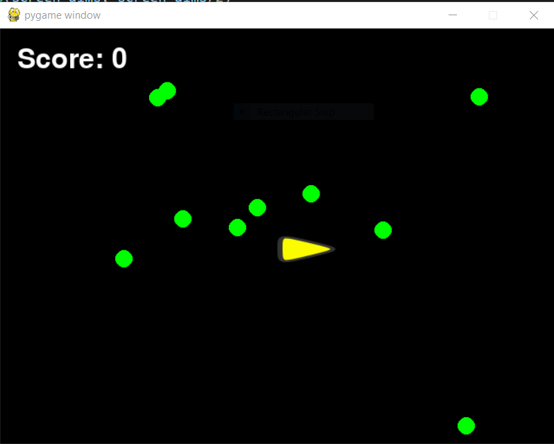

This is the branch for the first pygame - bruno-bounce.

https://www.petercollingridge.co.uk/tutorials/pygame-physics-simulation/movement/

[Youtube video of the first version](https://youtu.be/-dpumE5t9QM)
